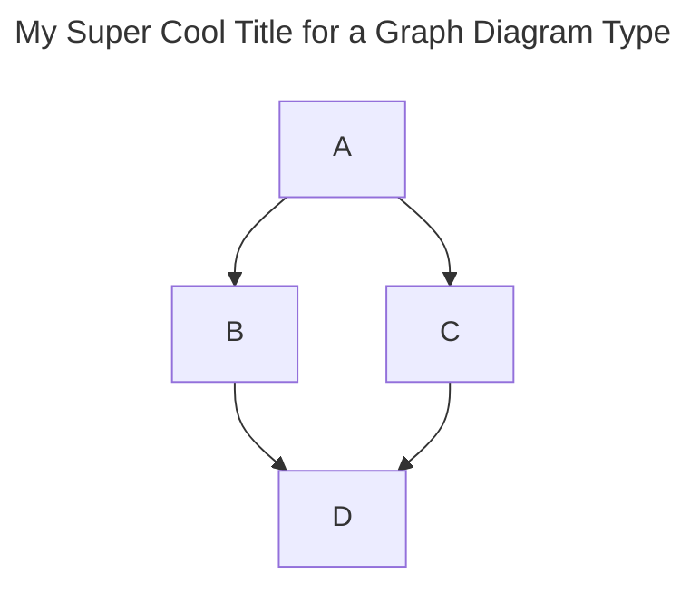
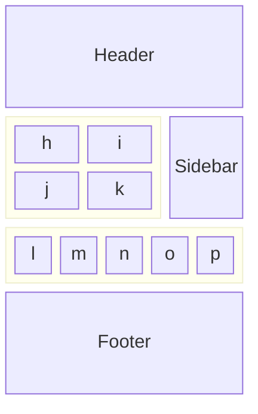

Story points maybe complicating your planning and misleading you into thinking your duration and cost estimates are more accurate than they really are.

import svgReference from "./images/image.svg";
import { Image } from "astro:assets";
import myImage from "./images/image1-1200x627.jpg";
import pagespeedImage from "./images/post-1/pagespeed-score.png";

## Table of contents

There are many practices or Techniques that seemed to be a good idea at the time. Story pointing is one of those techniques that can be simplified by just counting work items per a unit of time.

The following diagram shows how a web pages can be assembled out of components.

## The first questions

Customers or stakholders always ask when will you be done and how much will it cost. 
I am sure you also ask the same questions when you go shopping.

## A walk through history

Obviously the team provided an answer. A duration estimate for each Story, work item, was provided. Unfortunately these estimates frequently turned out to be inaccurate because when estimating the duration time spent in meetings and other non-storey activities were not taken into account. So begun the practice of refeerring to the estimates as "Ideal days".  The duration that it would take if there were no distractions. But as that is not the case in the real world we would multiply the 

## The core question “When will it be done?”

One approach is to this question is to try and get the customer to specify the requirements in enough detail so that an experenced developer can estimate the development time.
This can then used to provide an estimated delivery date and thus cost.

Unfortuniately the track record of estimating software Projects is not great. Many are delivered late that estimated.

Let us revisit how we got here.

We started by breaking the requirements into sufficiently small components. We then estimated how many days it would take to develop and test. When scheduled by taking into accpount dependencies and resources we can come up with a duration.  Knowing the cost of the resources we can then answer the duration and cost question.

We want to know how much it would cost to modernize our front end so we can decide whether to proceed.
we don't care about the plan. We're not sure if we want this. We just want a ballpark figure of how much it would cost to complete this project.

In reality we found that 

We can't predict the future, and therefore, planning is useless. Prioritization is our only tool.
It's a mistaken worldview that hurts our businesses.
We can't plan because software development is too unpredictable. I hear that a lot.

So they try to answer because the can ended up on their doorstep.
a flawed attempt at doing the job Engineering was better equipped to do.

It's uncommon to gather new insights that throw the product into complete upheaval. We build software through small, gradual changes, not through big moves. That also means we learn in small insights, not in grand epiphanies.
sometimes, teams really have an uncertain situation. Every time they try to tame the chaos, their plan derails.

Estimates are a great tool for short-term planning. They are horrible for the long term. If your team relies on estimates for long-term planning

 taken more time to describe the problem they wanted to solve rather than rushing into implementing a solution.

 unexpected stuff will always happen, a good plan gives us the tools to steer the product. It acts as an early warning system that allows us to choose the next steps rather than having our hands forced by reality.

 Product plans, like their products, are never first-time-right. Plans, like their software, are iterative products. We inspect and adapt all the time. In this context, a roadmap is not Big Design Upfront. It's a communication device to align teams and stakeholders. product management, the goal is not to stick to a schedule. The goal is to adapt our product to reality, its feedback, and events. Our plan will reflect that.

 crucial distinction. Projects can be behind schedule.

 our plans can be out of sync with reality.

 goal of planning is not to predict these events. It's to give us the tools to assess their impact on our teams and adapt.

  pretending we still might be on track, we could communicate the impact of these events long before they would affect the stakeholders.

  Stakeholders are perfectly fine with this. They don't mind a change of plans. They do loathe a last-minute change of plans.

  we need estimates to build professional software. They are imperfect but crucial tools for planning and budgeting.

we can't build everything we would like to build. That's just a fact of life.
Replanning by moved as many features as possible to Phase 2.
deadline-driven plans impact on Quality which result in shifting cost to the future.

Estimation by team.
Product teams seem to be the holy grail of software development these days. They own (a part of) a product and are responsible for maintaining, improving, and expanding it. These teams are self-organized and cross-functional. They have a clear, laser-focused mission and all the tools to get there. These teams are typically long-lived and need to build their internal knowledge base.
Life cycle is important.

Gantt charts were dumb all of a sudden. Remnants of the old world. They were "not Agile" and certainly not "true Scrum". In the course of a single decade, it became socially acceptable to claim that "we can't predict the future" and "anything further than two weeks is gambling".

For agile teams, project management is often perceived as a burden of documentation, processes, and reporting, slowing down progress.

We invented Story Points, backlogs, and Now-Next-Later gizmos to ensure no one could calculate a due date.

days of heavyweight planning are behind us

expect change
stakeholders will demand flexibility and predictability at the same time. They will ask you to drop everything to build this shiny new feature and expect you to stick to the plan. That's fine. They've been working without a plan and still need to learn to adapt. This will be your main weapon: "If we prioritize Shiny New Feature, we'll have to postpone Expensive Promise to November. Is that what you want?"

## Buffers

The problem with a buffer is that you only know it was not big enough when you burn
through it. That's why you don't just want to slap a big "contingency" buffer at the end
of the project. Cutting into the buffer after a work item is totally fine. That's why it's
there. Burning through it completely, however, is an early warning system. You don't
want to move that early warning system to the final weeks of the project.
Sprinkle buffers throughout the timeline rather than keeping one at the end.

airport metaphor because it gives us a good rule of thumb.
If the price for being late is high, the buffer should be big.
If the penalty for being late is low, we can try to cram in a little bit more work.
We need to actively tip the scales of predictability/productivity depending on the cost of being late.

Sustainable pace doesn’t mean the same rhythm all the time. It means balancing productivity and predictability without ever having to make a last-minute dash toward the gate.

limit the number of concurrent initiatives, we can apply iterative buffer planning. Let's say we estimate about six weeks of work. We can break that up into three two-week timeboxes. We follow the same pattern as Focus Blocks and place those time boxes

# delivery

get the team laser-focused on delivering rather than "Agile theatre"

face is a never-ending stream of distractions and seductions that make it hard to keep our eyes on the prize. 

# Roadmap

software development has lost the art of planning because we no longer make plans in Agile.
Maintaining such a plan isn’t free. We need to do the work. If we spend more time than predicted on a certain feature, we need to adapt the plan

we only rely on backlog prioritization, we don't have such a mirror. We don't know whether we are on schedule if there is no schedule. And that makes it nigh impossible to keep long-term goals and promises.
We deviate because we fail to adapt to reality or neglect what we set out to achieve. 

roadmap, they're not asking for a Gantt chart that predicts the future. They're asking for a tool to keep our eyes on the ball. An early warning system that goes off when we're not doing what we said we would do.

roadmaps allow the stakeholders to ask When questions and see the impact of switching priorities.

What they are really asking is: "Give me an insight into the expected workload so I can justify the hiring budget."

That's about utilization and has little to do with team productivity. 
occasionally struggle to find problem-related work for the mobile app guy,

## Reference

https://ronjeffries.com/articles/019-01ff/story-points/Index.html

